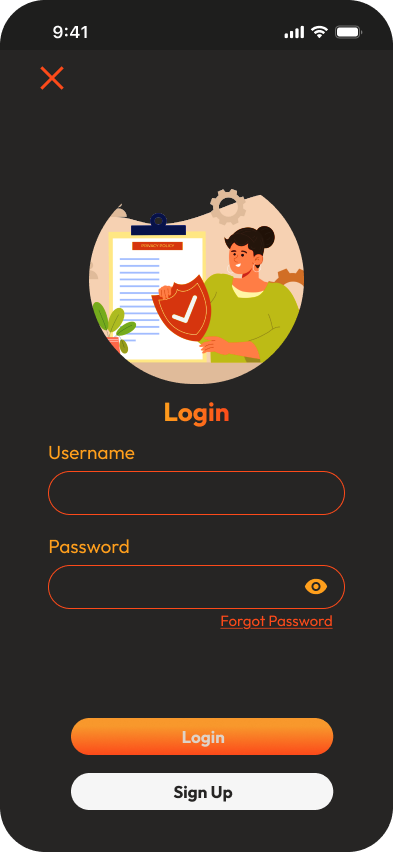
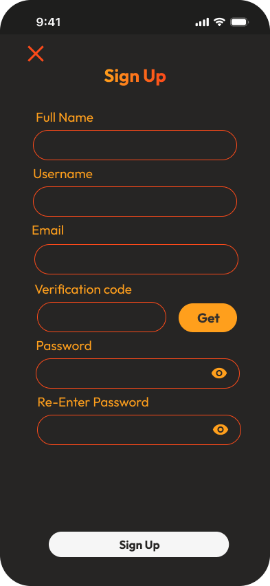
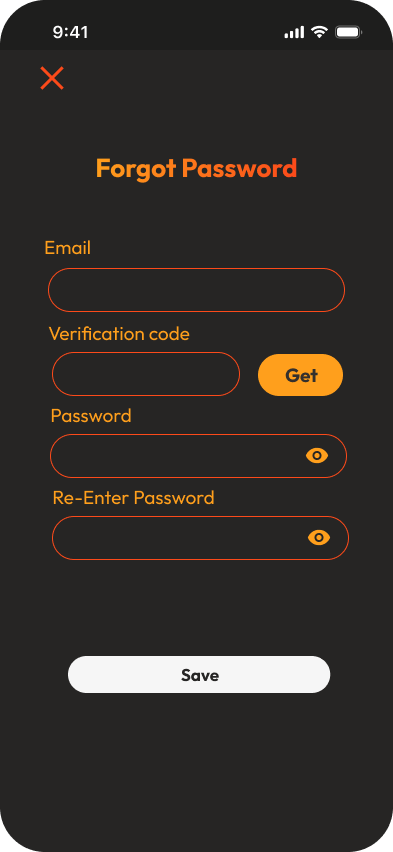
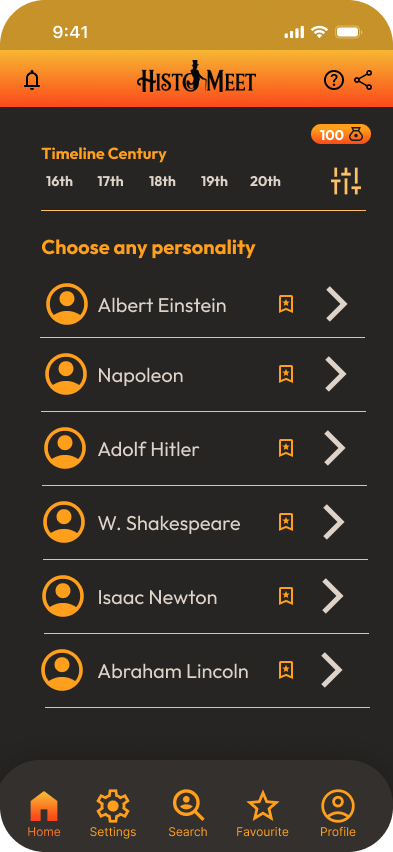
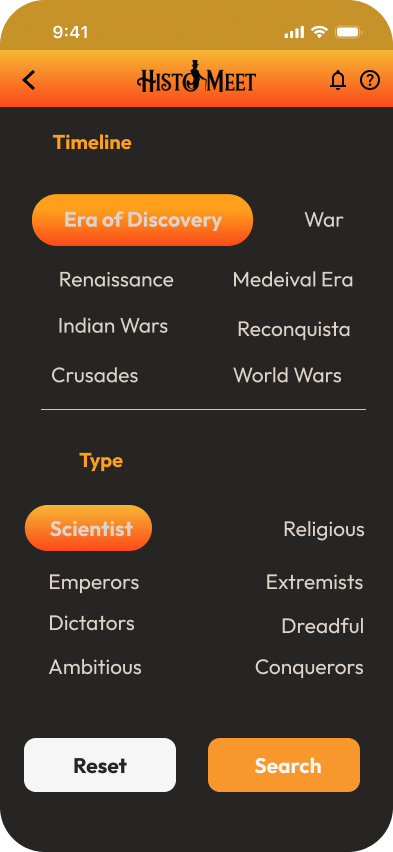
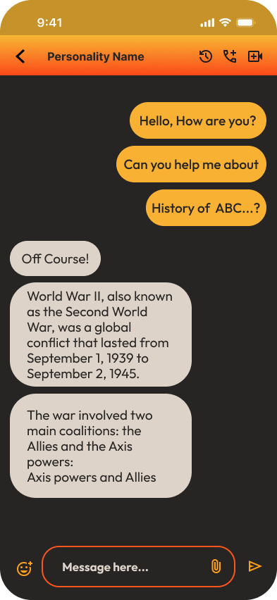
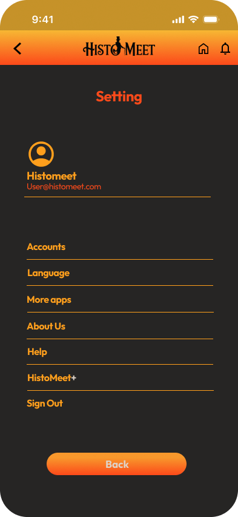
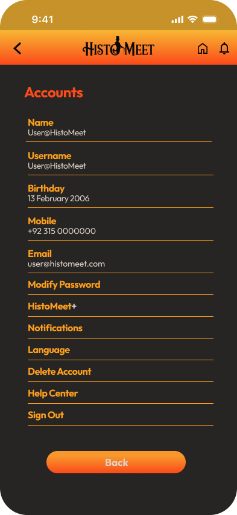
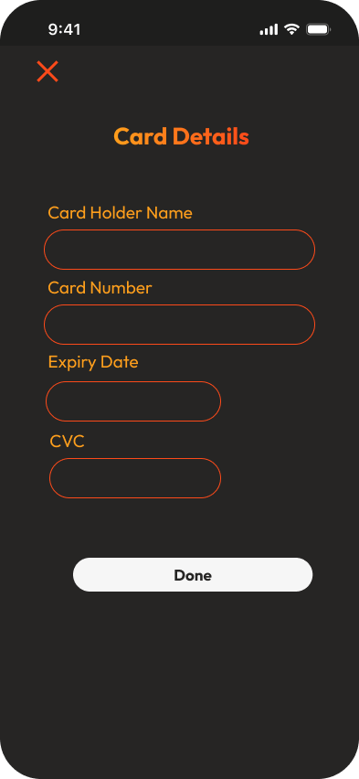
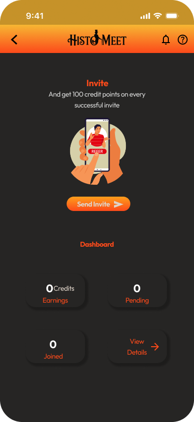

# 📱 Histomeet – Meet Legends from the Past

**Histomeet** is a UI/UX design prototype created as part of our **Human-Computer Interaction (HCI)** semester project at **COMSATS University**. The app allows users to travel through time by meeting famous historical personalities from different eras.

> 🧠 Imagine chatting with Albert Einstein, Julius Caesar, or Rumi — all in one app!

---

## 🎯 Purpose

This project was designed to explore **human-centered design** principles and craft an engaging user interface that feels both futuristic and historically immersive.

---

## 🔍 Features

- 🕰️ Timeline Filter – Select historical eras like the Renaissance, World Wars, or Crusades.
- 👑 Personality Types – Choose from scientists, emperors, dictators, conquerors, and more.
- 📜 Personality Profiles – View historical figures and interact with their AI chat avatars.
- 🌐 Multi-Language Support – Interface available in Urdu, Arabic, French, Chinese, and more.
- 🔐 Sign Up / Login – Full authentication UI flow.
- ⭐ Favourites – Save your favorite personalities.
- 💬 Invite & Credits – Invite others and earn credits for premium content.
- 🚀 Premium Features (HistoMeet+) – Unlock advanced AI, custom avatars, and unlimited chats.

---

## 🛠️ Tools Used

- **Figma** – UI/UX Design & Prototyping
- **Material Icons** for icons
- **Google Fonts** for fonts 

---

## 📷 Screenshots

### 🔐 Authentication Flow
| Splash Screen | Login | Signup | Forgot Password |
|---------------|-------|--------|-----------------|
|  |  |  |  |

---

### 🏠 Main App Screens
| Home | Timeline Filter | Chat |
|------|------------------|------|
|  |  |  |

---

### ⚙️ Settings & Account
| Settings | Account |
|----------|---------|
|  |  |

---

### 💳 Extras
| Payment Method | Share / Invite |
|----------------|----------------|
|  |  |

---

## 🔗 Live Prototype

👉 [View the Interactive Figma Prototype](https://www.figma.com/design/87zDGjMBjTJzTdQpZbrDdl/HCI-Project?node-id=0-1&t=nkVRYEPqDdEztgER-1)

---

## 🧠 What I Learned

- Applying real-world HCI principles like feedback, accessibility, consistency, and user control.
- Designing for a futuristic yet educational user experience.
- Building structured, user-friendly UI wireframes and prototypes in Figma.

---

## 🚀 Future Plans

- Integrate AI chat functionality using ChatGPT or similar APIs.
- Develop a Flutter version based on this design.
- Add more detailed historical character profiles with timelines.

---

## 💬 Feedback Welcome!

Feel free to share feedback or improvements. Contributions are welcome via issues or pull requests.

---

